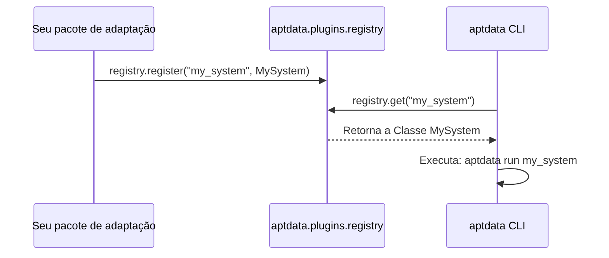

# Plugins e Registro

O *plugin registry* global permite que pacotes e *engines* externas
registrem implementações concretas de sistemas, possibilitando que a CLI os
descubra e os instancie dinamicamente pelo nome — sem exigir nenhuma
modificação ou hardcode no núcleo do `aptdata`.

---

## Como Funciona



---

## Registrando um Sistema

```python
# my_package/systems.py
from pydantic.dataclasses import dataclass as pydantic_dataclass
from aptdata.core import BaseSystem, IFlow
from aptdata.plugins import registry


@pydantic_dataclass
class SalesSystem(BaseSystem):
    def __post_init__(self) -> None:
        self._flows: list[IFlow] = []

    def register_flow(self, flow: IFlow) -> None:
        self._flows.append(flow)

    def run(self) -> None:
        for flow in self._flows:
            flow.run([])


# Registre globalmente no import para que a CLI possa localizar o artefato
registry.register("sales_system", SalesSystem)
```

Após o registro, a execução torna-se transparente:

```bash
aptdata run sales_system --env prod
```

---

## Descoberta Automática (Auto-Discovery) com Entry Points

A integração mais escalável para bibliotecas é declarar um grupo de
*entry-points* chamado `aptdata.systems` diretamente no `pyproject.toml`. Isso
registra o plugin implicitamente no momento da instalação (`pip install`):

```toml
[tool.poetry.plugins."aptdata.systems"]
sales_system = "my_package.systems:SalesSystem"
```

!!! tip "Em Desenvolvimento"
    A funcionalidade automática de leitura de entry-points embutida na
    instalação estará disponível nos próximos releases. Por hora, invoque
    explicitamente `registry.register()` no tempo de inicialização do seu
    pacote.

---

## API do `_SystemRegistry`

::: aptdata.plugins._SystemRegistry

---

## Instância Singleton Global

::: aptdata.plugins.registry
