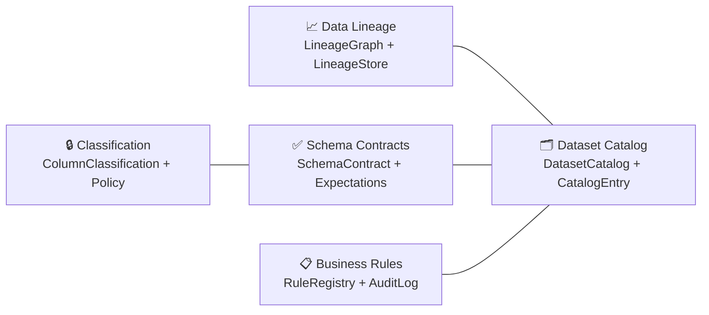
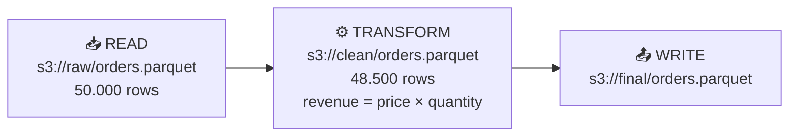

# Governança (Governance)

O `aptdata` possui uma camada nativa (*first-class*) de governança de dados que atua de forma transversal sobre a execução dos seus pipelines, garantindo rastreabilidade e conformidade.

A governança é dividida em quatro pilares principais:

<div class="grid cards" markdown>

-   :material-source-branch: **Data Lineage**

    Grafo de proveniência rastreando cada leitura, transformação e escrita (`LineageGraph`).

-   :material-shield-check: **Data Quality & Contracts**

    Contratos estáticos de schema e *suite* de expectativas (`SchemaContract`).

-   :material-book-open-outline: **Business Rules Registry**

    Catálogo versionado de regras de negócio com trilha de auditoria (`RuleRegistry`).

-   :material-archive-search: **Dataset Catalog**

    Repositório pesquisável de metadados e classificação de dados sensíveis (`DatasetCatalog`).

</div>



---

## Data Lineage (Linhagem de Dados)

### Visão Geral

O subsistema de linhagem reside em `aptdata.core.lineage`. Toda execução de *workflow* produz um `LineageGraph` contendo uma lista ordenada e imutável de objetos `LineageNode`.



```python
from aptdata.core.lineage import (
    ColumnLineage,
    LineageEventType,
    LineageGraph,
    LineageNode,
)

# Inicializa o grafo para uma execução específica
graph = LineageGraph(run_id="run-20240101", workflow_name="etl_pipeline")

read_node = LineageNode(
    dataset_uri="s3://raw/orders.parquet",
    event_type=LineageEventType.READ,
    workflow_name="etl_pipeline",
    rows_out=50_000,
)
graph.add_node(read_node)

transform_node = LineageNode(
    dataset_uri="s3://clean/orders.parquet",
    event_type=LineageEventType.TRANSFORM,
    engine="pandas",
    rows_in=50_000,
    rows_out=48_500,
    parent_node_ids=[read_node.node_id],
    column_lineage=[
        ColumnLineage(
            target_column="revenue",
            source_columns=["price", "quantity"],
            transformation="price * quantity",
        )
    ],
)
graph.add_node(transform_node)

# Navegação no grafo
upstream = graph.get_upstream(transform_node.node_id)   # Retorna [read_node]
downstream = graph.get_downstream(read_node.node_id)    # Retorna [transform_node]

# Serialização limpa (pronta para JSON Lines)
d = graph.to_dict()
```

### Lineage Store

A classe `LineageStore` (em `aptdata.plugins.governance`) é utilizada para persistir e consultar grafos em memória ou enviar para um banco de metadados.

```python
from aptdata.plugins.governance import LineageStore

store = LineageStore()
store.save(graph)

loaded = store.load("run-20240101")
runs   = store.list_runs()
graphs = store.query_by_dataset("s3://raw/orders.parquet")
```

!!! tip "Emissão Automática via Event Bus"
    Como definido na [ADR 001](ADR-001-Revisao-Arquitetural-Core.md), a linhagem é preferencialmente extraída de forma automática via *hooks* do `EventBus` durante a compilação e execução do `BaseFlow`, poupando o desenvolvedor de instanciar os nós manualmente.

---

## Registro de Regras de Negócio (Business Rules Registry)

Gerencia e audita políticas aplicadas sobre os dados.

```python
from aptdata.plugins.governance import (
    BusinessRule,
    RuleAuditEntry,
    RuleRegistry,
    RuleStatus,
)

registry = RuleRegistry()

# 1. Registro da Regra
registry.register(BusinessRule(
    rule_id="BR-001",
    name="Revenue must be positive",
    owner="finance-team",
    expression="revenue > 0",
    tags=["finance", "revenue"],
))

# 2. Consultas
rule = registry.get("BR-001")
finance_rules = registry.list_rules(tag="finance")

# 3. Trilha de Auditoria (Logs)
registry.record_audit(RuleAuditEntry(
    rule_id="BR-001",
    status=RuleStatus.APPLIED,
    workflow_name="etl_pipeline",
    trace_id="abc123",
    rows_affected=48_500,
))

log = registry.get_audit_log(rule_id="BR-001")
```

---

## Catálogo de Datasets (Dataset Catalog)

Repositório central para busca e descoberta de dados.

```python
from aptdata.plugins.governance import DatasetCatalog, DatasetCatalogEntry
from aptdata.plugins.governance.classification import ColumnClassification

catalog = DatasetCatalog()

catalog.register(DatasetCatalogEntry(
    uri="s3://datalake/orders.parquet",
    name="Orders",
    description="Registros de pedidos do sistema OLTP principal.",
    owner="data-engineering",
    tags=["orders", "finance"],
    classification=ColumnClassification.CONFIDENTIAL,
))

# Recuperação e Busca
entry = catalog.get("s3://datalake/orders.parquet")
results = catalog.search(owner="data-engineering", tag="finance")
```

---

## Políticas de Classificação de Dados

Definições formais sobre tempo de retenção, necessidade de criptografia e perfis de acesso baseados na sensibilidade da informação.

```python
from aptdata.plugins.governance.classification import (
    ColumnClassification,
    DataClassificationPolicy,
)

policy = DataClassificationPolicy(
    name="LGPD PII Policy",
    description="Controles rígidos para colunas contendo dados pessoais identificáveis.",
    pii_columns=["email", "phone", "full_name"],
    retention_days=365,
    encryption_required=True,
    access_roles=["data-engineers", "privacy-team"],
)
```

### Integração com Quality Contracts

O catálogo de metadados acopla-se diretamente aos Contratos de Schema (ver [Quality](quality.md)):

```python
from aptdata.plugins.quality import ColumnClassification, ColumnContract, SchemaContract
from aptdata.plugins.governance import DatasetCatalog, DatasetCatalogEntry

contract = SchemaContract(
    name="orders_v1",
    version="1.0.0",
    owner="data-engineering",
    columns=[
        ColumnContract(name="id",    dtype="int64", nullable=False),
        ColumnContract(name="email", dtype="str",   nullable=False, pii=True,
                       classification=ColumnClassification.PII),
    ],
)

catalog = DatasetCatalog()
catalog.register(DatasetCatalogEntry(
    uri="s3://datalake/orders.parquet",
    name="Orders",
    schema_contract=contract,
))

# Extrai metadados sensíveis diretamente do contrato
pii_cols = contract.get_pii_columns()
```

---

## Fluxo de Validação de Contratos (Data Contracts)

```mermaid
flowchart LR
    %% Estilos Customizados (Design Premium)
    classDef default fill:#0b132b,stroke:rgba(255,255,255,0.2),stroke-width:1px,color:#fff,rx:8px,ry:8px;
    classDef accent fill:#ff6a00,stroke:#ff6a00,stroke-width:1px,color:#fff,rx:8px,ry:8px;
    classDef success fill:#0d2b18,stroke:#178a3f,stroke-width:1px,color:#fff,rx:8px,ry:8px;
    classDef danger fill:#2b0d0d,stroke:#8a1717,stroke-width:1px,color:#fff,rx:8px,ry:8px;
    classDef interface fill:transparent,stroke:rgba(255,255,255,0.4),stroke-width:1px,stroke-dasharray: 5 5,color:#fff;

    %% Nós do Sistema
    A[(Fonte de Dados)] --> B{Validar Contrato<br>Pydantic}

    %% Ramificações Condicionais
    B -- Contrato Válido --> C[Processamento<br>aptdata Engine]:::success
    B -- Falha na Validação --> D[Dead Letter Queue<br>Quarentena]:::danger

    %% Roteamento Dinâmico
    C --> E{Roteamento<br>por Metadados}:::accent

    E -- Qualidade Alta --> F[Data Warehouse<br>Gold Layer]
    E -- Necessita Tratamento --> G[Limpeza Avançada]

    %% Agrupamento (Subgrafos com linha tracejada)
    subgraph Governança Estrita
        B
        D
    end
    class Governança Estrita interface;
```
