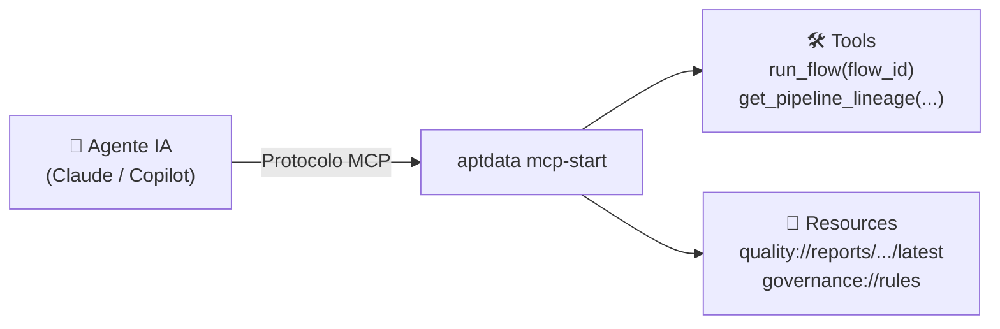

# Servidor MCP (Integração IA)

O servidor [Model Context Protocol (MCP)](https://modelcontextprotocol.io/) embutido no `aptdata` permite que agentes de IA autônomos descubram, auditem e executem pipelines na sua infraestrutura.

---

## Visão Geral

Baseado no [FastMCP](https://github.com/jlowin/fastmcp), a infraestrutura é exposta à IA por duas vias:

- **Tools:** Ações ativas que modificam estado ou extraem dados (ex: `run_flow`).
- **Resources:** URIs de leitura sob demanda (ex: schemas, relatórios).



---

## Iniciando o Servidor

Para habilitar a integração MCP, instale o grupo opcional `ai`:
```bash
pip install "aptdata[ai]"
```

=== "Transporte Stdio (Default)"
    Utilizado pela maioria dos clientes de desktop (Claude Desktop, Cline, Continue.dev). A comunicação ocorre via *standard input/output*.
    ```bash
    aptdata mcp-start
    ```

=== "Transporte SSE"
    Ideal para integrações baseadas na web (HTTP Server-Sent Events). O servidor inicia localmente na porta `8000`.
    ```bash
    aptdata mcp-start --transport sse
    ```

---

## Ferramentas (Tools) Expostas

A IA possui acesso nativo aos seguintes comandos:

| Ferramenta (Tool) | Assinatura | Descrição |
|---|---|---|
| `run_flow` | `(flow_id: str)` | Executa um sistema registrado no *Registry* e retorna o status. |
| `list_registered_systems` | `()` | Lista todos os sistemas orquestráveis disponíveis. |
| `list_available_plugins` | `()` | Lista adaptadores e conectores de infraestrutura instalados. |
| `get_plugin_schema` | `(plugin_name: str)` | Retorna o schema Pydantic exato exigido por um componente. Elimina alucinações da IA na hora de gerar código. |
| `preview_dataset` | `(reader: str, limit: int)`| Retorna as primeiras *N* linhas reais para a IA inspecionar os dados. |
| `get_pipeline_lineage` | `(flow_id: str)` | Retorna a árvore de dependência (DAG) e a linhagem de colunas. |

---

## Recursos (Resources) Expostos

Recursos funcionam como URIs internas para o agente consumir contexto sob demanda.

| Padrão URI | Retorno para a IA |
|---|---|
| `schema://datasets/{name}` | JSON Schema (Tipagem) para o dataset informado. |
| `quality://reports/{workflow}/latest`| Último relatório de qualidade (QualityReport) com contagem de erros e regras falhas. |
| `governance://rules` | Lista de Regras de Negócios registradas no catálogo. |

---

## Configurando no Claude Desktop

Adicione o servidor `aptdata` ao arquivo de configuração do Claude Desktop:

- **macOS:** `~/Library/Application Support/Claude/claude_desktop_config.json`
- **Windows:** `%APPDATA%\Claude\claude_desktop_config.json`

```json
{
  "mcpServers": {
    "aptdata": {
      "command": "aptdata",
      "args": ["mcp-start", "--transport", "stdio"]
    }
  }
}
```

Após reiniciar o aplicativo, o agente será capaz de entender seu banco de dados e rodar seus fluxos de forma autônoma.
