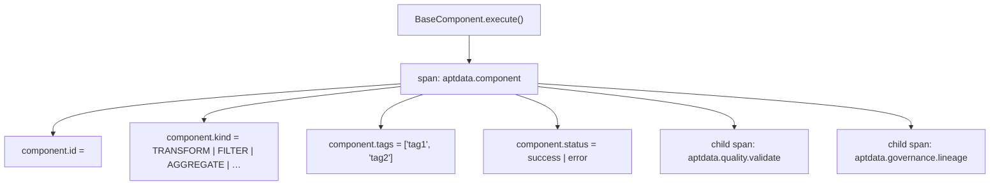

# Telemetria e Observabilidade (Telemetry)

O **aptdata** integra-se nativamente com o [OpenTelemetry](https://opentelemetry.io/), provendo observabilidade *zero-config* e instrumentação automática para todas as execuções de pipeline.

---

## Visão Geral

Toda classe que herda de `BaseComponent` é auto-instrumentada sem necessidade de alterar o código de negócio. A invocação de `execute()` gera automaticamente um *Span* contendo os metadados do componente.



*Child spans* emitidos por Validadores de Qualidade e Governança garantem visibilidade end-to-end granular.

---

## Comandos da CLI (`telemetry`)

<div class="grid cards" markdown>

-   :material-signal-cellular-outline: **`telemetry status`**

    Exibe a configuração atual e o status da integração OpenTelemetry no ambiente.
    ```bash
    aptdata telemetry status [--json]
    ```

-   :material-upload-network: **`telemetry export`**

    Esvazia o *buffer* de spans locais e os força para o *exporter* configurado (Console ou OTLP).
    ```bash
    aptdata telemetry export [--format json]
    ```

</div>

---

## Spans Auto-Instrumentados

| Nome do Span | Emitido Por | Principais Atributos (`attributes`) |
|---|---|---|
| `aptdata.component` | `BaseComponent.execute()` | `component.id`, `component.kind`, `component.tags` |
| `aptdata.quality.validate` | `QualityValidator.validate()` | `quality.rule_count`, `quality.enforcement` |
| `aptdata.governance.lineage`| `LineageStore.save()` | `lineage.run_id`, `lineage.workflow` |
| `aptdata.transform` | `PandasTransformer` / `PySparkTransformer`| `transform.engine`, `transform.rows_in`, `transform.rows_out` |

!!! warning "Mascaramento Automático"
    O módulo de telemetria inspeciona *payloads* em busca de chaves sensíveis (ex: `password`, `token`, `secret`, `key`) e mascara seus valores com `***` antes de exportar o evento para o OTLP.

---

## Integração de Backends

=== "Jaeger (Desenvolvimento Local)"

    Inicie o serviço do Jaeger via Docker:
    ```bash
    docker run -d --name jaeger \
      -p 16686:16686 \
      -p 4317:4317 \
      jaegertracing/all-in-one:latest
    ```

    Aponte as variáveis de ambiente e rode seu sistema:
    ```bash
    export OTEL_EXPORTER_OTLP_ENDPOINT="http://localhost:4317"
    export OTEL_SERVICE_NAME="aptdata"

    aptdata run my_system
    ```
    Abra `http://localhost:16686` para visualizar a árvore de *traces*.

=== "OTLP (Produção)"

    Utilize a integração genérica para enviar eventos para qualquer *collector* OTLP compatível (Datadog, Grafana Tempo, Honeycomb):
    ```bash
    export OTEL_EXPORTER_OTLP_ENDPOINT="https://api.honeycomb.io"
    export OTEL_EXPORTER_OTLP_HEADERS="x-honeycomb-team=<API_KEY>"
    export OTEL_SERVICE_NAME="aptdata"

    aptdata run my_system
    ```

---

## Desabilitando a Telemetria

Caso precise desligar a telemetria completamente para otimizar performance em testes locais, utilize a variável de ambiente padrão do SDK do OpenTelemetry:

```bash
export OTEL_SDK_DISABLED="true"
aptdata run my_system
```
